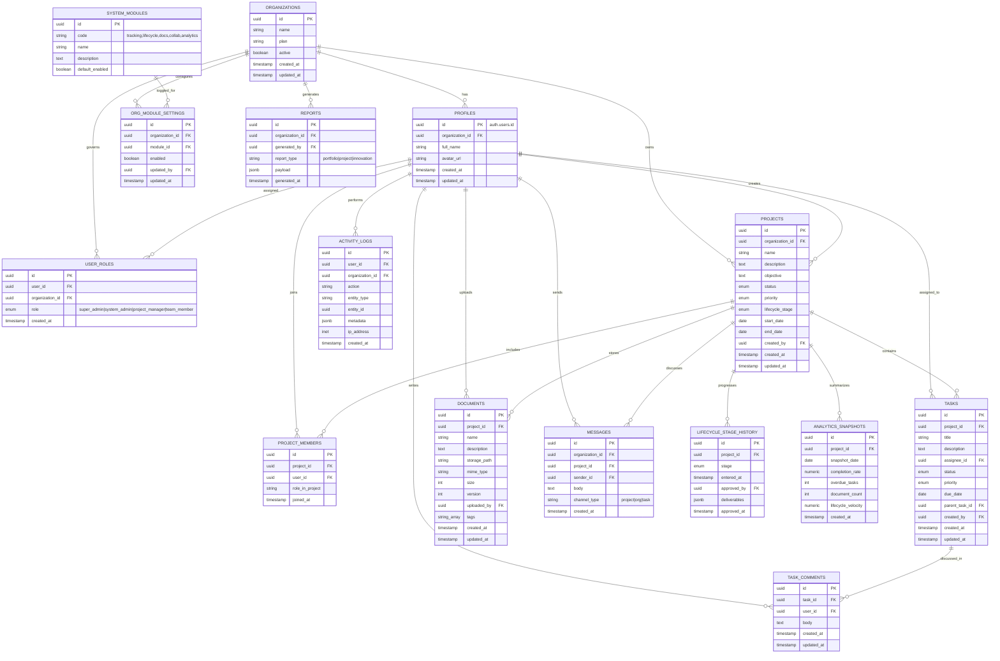

# InnoTrack ERD (Service-Aligned v1)

This ERD is designed from your requested services and use cases, with multi-tenant organizations, role-based access, module activation, project lifecycle, collaboration, documentation, analytics, and auditability.

## Core Services Covered

1. Project Tracking and Monitoring Services
2. Product Development Lifecycle Management Services
3. Research Documentation and File Management Services
4. Collaboration and Communication Services
5. Innovation Analytics and Reporting Services

## Mermaid ERD

## Why These Additional Tables

1. `SYSTEM_MODULES` + `ORG_MODULE_SETTINGS`
   - Needed for Super Administrator capability to activate/deactivate modules per organization.
2. `MESSAGES`
   - Supports Collaboration and Communication beyond task comments.
3. `ANALYTICS_SNAPSHOTS` + `REPORTS`
   - Supports Innovation Analytics and Reporting as first-class data, not derived-only.
4. `ACTIVITY_LOGS` with `organization_id`
   - Improves audit log filtering for both Super Admin and System Admin usage.

## Role-to-Data Responsibility Mapping

1. Super Administrator
   - `organizations`, `system_modules`, `org_module_settings`, `activity_logs` (global oversight)
2. System Administrator (Org Manager)
   - `profiles`, `user_roles`, `org_module_settings`, `activity_logs` (org scope)
3. Project Manager
   - `projects`, `project_members`, `tasks`, `lifecycle_stage_history`, `reports`
4. Team Member
   - `tasks` (assigned updates), `documents` (uploads), `task_comments`, `messages`

## Notes for Current SQL Alignment

Your existing schema already has most core entities. To fully align with this ERD, add these tables in the next migration:

1. `system_modules`
2. `org_module_settings`
3. `messages`
4. `analytics_snapshots`
5. `reports`

Also consider adding `organization_id` to `activity_logs` if you want faster organization-level audit queries.
